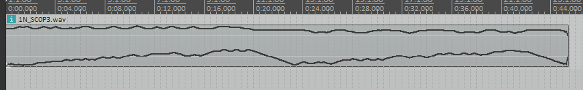
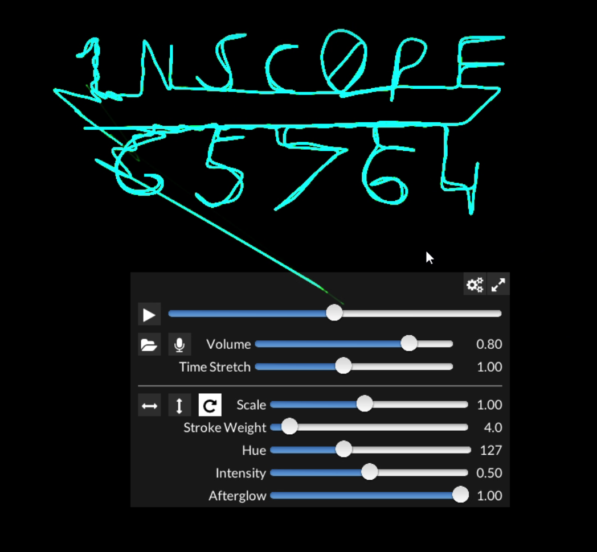

# In Scope
#### Stego - 384
This was part of the BIRDTHIEF series of challenges with the hint there just being this overlaid waveform at the bottom of the slide.

Looking at the attached `1N_SC0P3.wav`, we can see strangely smooth waveforms for the right and left channels. To me, this made it clear that this was not some kind of binary data encoded in the waveform.

## Solution
Looking at the right channel, I saw two roughly increasing slopes indicating some sort of cycle, putting this with the name of the challenge, I guessed that these channels were encoding x and y coordinates to be plotted over time, like on a CRT oscilliscope.

My teammate found a software that did exactly that (https://oscilloscopemusic.com/osci.php), and this revealed the flag:

`RS{1NSC0PE65764}`
